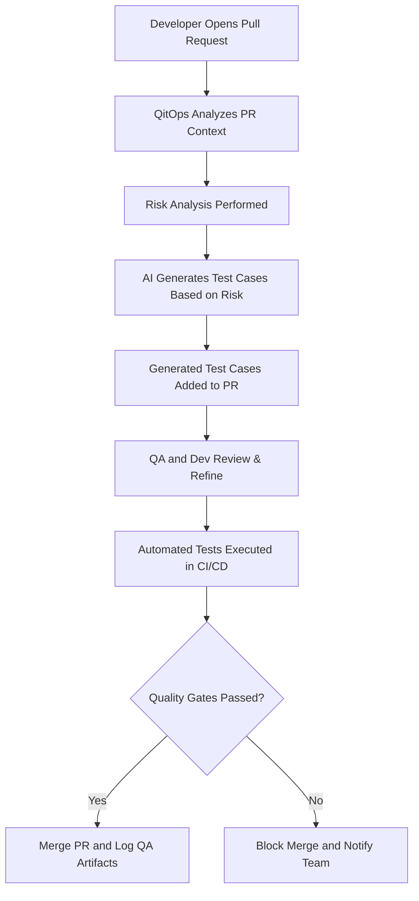

### **QitOps: Concept and Vision**

**QitOps** is the practice of embedding quality assurance (QA) processes directly into the Git-based workflows of modern software development. It ensures that QA is not a siloed or afterthought activity but a continuous, collaborative, and automated part of the development lifecycle.

At its core, QitOps leverages [GitOps](https://shalb.com/blog/gitops-an-introduction-to-gitops-principles-and-practices/) principles—treating everything as code—to integrate testing, risk analysis, and quality metrics into the workflows developers and QA engineers already use.

---

### **Core Tenets of QitOps**

1. **QA as Code**:
    
    - Test cases, risk assessments, and quality gates are stored and managed as code in [Git repositories](https://www.simplilearn.com/tutorials/git-tutorial/what-is-a-git-repository).
    - [Test artifacts](https://artoftesting.com/test-artifacts-deliverables) (e.g., test cases, coverage reports) are versioned alongside application code.
2. **Seamless Integration**:
    
    - QA workflows are triggered automatically by Git events (e.g., [pull requests](https://docs.github.com/en/pull-requests/collaborating-with-pull-requests/proposing-changes-to-your-work-with-pull-requests/about-pull-requests), commits, merges).
    - QA becomes a natural part of the developer workflow, reducing handoffs and friction.
3. **Context-Aware Quality Assurance**:
    
    - QA processes adapt dynamically based on the context of code changes (e.g., [diffs](https://www.atlassian.com/git/tutorials/saving-changes/git-diff#:~:text=Diffing%20is%20a%20function%20that,%2C%20branches%2C%20files%20and%20more.), file types, PR descriptions).
    - Focused and relevant testing is prioritized, improving efficiency.
4. **Collaboration-Driven**:
    
    - QA is integrated into pull requests and [code reviews](https://about.gitlab.com/topics/version-control/what-is-code-review/), fostering collaboration between developers and QA engineers.
    - Teams can comment, refine, and approve test cases directly within PRs.
5. **Automation First**:
    
    - Automated pipelines handle test case generation, execution, and validation.
    - [Risk analysis](https://www.lambdatest.com/blog/how-to-incorporate-risk-management-strategy-in-testing/) and quality metrics are generated programmatically.
6. **Transparency and Metrics**:
    
    - QA workflows provide clear visibility into [quality metrics](https://www.testrail.com/qa-metrics/#glossary-of-qa-metric-formulas-5), such as test coverage, defect rates, and risk levels.
    - Metrics are made accessible to all stakeholders, enhancing accountability.

---

### **Key Components of QitOps**

1. **GitHub Integration**:
    
    - QA workflows are tightly integrated with GitHub (or similar platforms, such as Bitbucket, Gitlab, CodeCommit etc) using APIs and GitHub Actions.
    - Test case generation and validation pipelines are triggered by PR events.
2. **AI-Powered Test Case Generation**:
    
    - Local or cloud-based LLMs analyze PRs, diffs, and descriptions to generate contextually relevant test cases.
    - AI assists with edge case identification, regression risks, and performance considerations.
3. **Dynamic Risk Assessment**:
    
    - Automated analysis of code changes to identify high-risk areas.
    - Risk levels influence the prioritization of test cases and QA workflows.
4. **Continuous Quality Feedback**:
    
    - PR comments, dashboards, and notifications provide real-time feedback on quality status.
    - Quality gates ensure critical issues are addressed before merging.
5. **Quality Pipelines**:
    
    - GitHub Actions or CI/CD tools execute automated tests based on generated cases.
    - Pipelines validate QA artifacts for completeness and consistency.

---

### **QitOps in Action**

#### Example Workflow:

1. **Developer Opens a PR**:
    
    - QitOps triggers an automated analysis of the PR (e.g., files changed, description, diff).
2. **Automated Test Case Generation**:
    
    - AI generates test cases based on the context of the changes.
    - Generated test cases are added as a comment or file in the PR.
3. **Risk Assessment and Metrics**:
    
    - The system evaluates the risk level of the changes and suggests areas requiring manual QA.
4. **Team Collaboration**:
    
    - QA engineers and developers review and refine test cases within the PR.
5. **Automated Validation**:
    
    - Pipelines execute tests and validate QA metrics, blocking the merge if quality gates are not met.
6. **Merge and Continuous Monitoring**:
    
    - Once all checks pass, the PR is merged, and QitOps logs the quality artifacts for future analysis.

## QitOps Workflow

---

### **Why QitOps Matters**

1. **Accelerates Development**:
    
    - Embedding QA into Git workflows reduces bottlenecks and handoffs.
2. **Improves Quality**:
    
    - Automated, context-aware QA ensures high coverage and better defect detection.
3. **Encourages Collaboration**:
    
    - QA and development teams work closely through Git, fostering a shared responsibility for quality.
4. **Scales with Teams**:
    
    - QitOps adapts to the scale and complexity of modern software projects, making it suitable for teams of all sizes.

---

### **Future of QitOps**

1. **Enhanced AI Capabilities**:
    - Use advanced NLP and diff analysis for deeper insights into changes.
2. **Multi-Tool Integration**:
    - Seamlessly work with tools like Jira, TestRail, and Slack.
3. **Community-Driven Standards**:
    - As an open-source initiative, QitOps could establish new standards for QA in DevOps workflows.

---

### Final Thoughts

QitOps is not just a workflow—it’s a philosophy that redefines how QA fits into modern software development. 